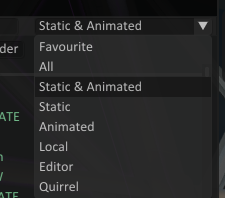

# Editor

#### The **Heated Metal** editor has very unity like controls

## Basic Controls

#### Some options can be rebinded by typing **`Setup`** in the console or on first boot

* **Left Mouse** - Select an entity (some entities have different collision type select them at the top "**Select Collision**")
* **Right Mouse Hold** - Unlocks view look and camera movement
* **Middle Mouse** - Opens Entity Context Menu (Requires selection)
* **W A S D** - Camera Movement
* **Q E** - Camera Down / Up Movement
* **Shift Hold** - Activates Camera Movement multiplier for faster movement
* **Left & Right Arrows\*** - Camera Roll **ONLY ACTIVE IN SCREENSHOT MODE** **(Right Mouse need to be held)**

## Camera Settings

#### Camera Speed controls can be changed in Editor -> Settings

#### This menu includes other options such as Speed deceleration, etc.

<figure><figcaption></figcaption></figure>

## Load Units

* This is a utility to load map load layers at runtime.
* An example you started a playlist with **`Official Day`** but didn't want to restart to change to **`Offical Night`.**
* Unloading the current layer is required for other layers data to take effect
* Some layers can be loaded at the same time
* Spamming load and unload will cause sieges loading system to hang for a bit because of the load request orders

<figure><figcaption></figcaption></figure>

## Entity Library

* The search bar filters by name. | `,` is a modifier to search for substrings in the current filter.
* Type list will filter by entity type.
* **Left Mouse** will select the entity.
* **Middle Mouse** on the hovered entity will Favourite it marked by `*` .
* **Right Mouse** opens entity component filter.
* **Shift Hold** will allow for list Range selection for example (Clicking entity A then holding shift then clicking to entity B will select all entities from A to B).

&#x20;                                      

## Folders

* Folders can be **created** and **removed** in the **Entity Library**
* Folders are map save file based
* Entities can be **added** and **removed** from the **Context Menu**

&#x20;       .png>).png>)

## Entity Properties

* _**Component changes cannot be restored to their original values a map reload is required**_
* Entity properties contains the entities components
* Components can be **Activated / Deactivated** some supported components have additional properties

#### To save properties into the map save file `Save Component` is required to be ticked

<figure><figcaption></figcaption></figure>

## Editor Types

* Can be found under Type at the top
* **Paint Mode** allows for painting with dust particles **(Limit of 100)**
* **Explosion Mode** allows for spawning explosions on demand

<figure><figcaption></figcaption></figure>
